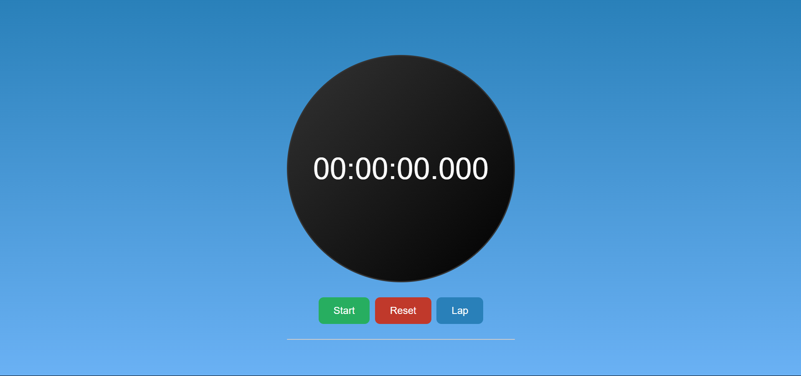
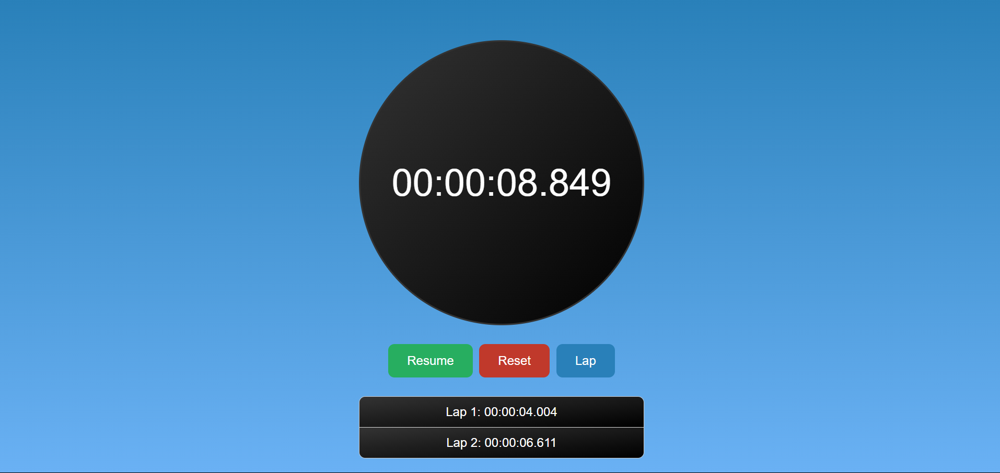

<h1 align="center">Stopwatch Application: </h1>

<h1 align="center">Stopwatch Application With Lap: </h1>

<h1>Key Features: </h1>

- ⏱️ Precision Timing: The stopwatch timer offers precise time measurements, perfect for tracking intervals, workouts, and events with accuracy down to milliseconds.

- ⏱️ User-Friendly Interface: Enjoy a simple and intuitive interface designed for ease of use, allowing you to start, pause, resume, and reset the timer with just a click.
  
- ⏱️ Lap Time Recording: Capture multiple time intervals effortlessly with our lap time feature, ideal for recording split times during races, workouts, or experiments.
  
- ⏱️ Customizable Display: Personalize your stopwatch with customizable display options, including different time formats, colors, and font sizes to suit your preferences.
  
- ⏱️ Performance Optimized: The stopwatch is optimized for performance, ensuring smooth operation even during prolonged use, without compromising accuracy or responsiveness.
